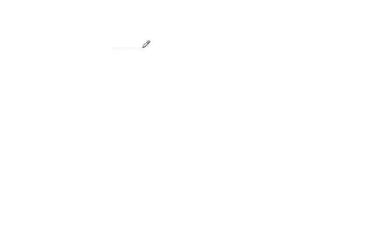
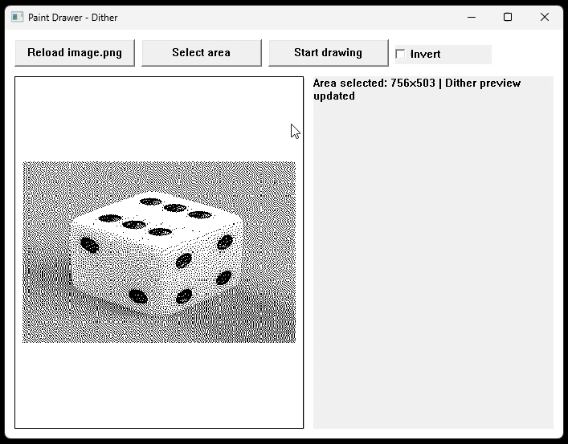

## Kas ?
Programa, kuri automatiškai perpieštų image.png į Microsoft Paint (veikia ir kitur) pasirinktame ekrano stačiakampyje. Per atskirą overlay langą leidžia pažymėti tikslinę sritį, tada su GDI+ paveikslą perskaluoja į tos srities dydį ir paverčia juodai balta 0/1 kauke, naudojant [Floyd–Steinberg dithering](https://en.wikipedia.org/wiki/Floyd%E2%80%93Steinberg_dithering). Toliau kaukė einama eilutėmis, gretimi juodi pikseliai sujungiami į horizontalias atkarpas, o piešimas vykdomas atskiroje gijoje per SetCursorPos ir SendInput, kad Paint gautų realius pelės veiksmus.

## Paleidimas
```bash
mingw32-make

mingw32-make run
```



